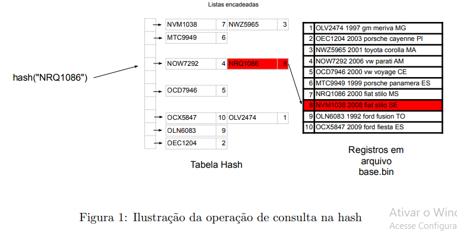

# Sistema de Blitz usando tabela Hash
 
(convert.c) Considerando o arquivo base.txt (disponível na pasta *base*) foi escrito um programa convert.c que converte a base para o formato binário de registros com os campos e gerar o arquivo base.bin .

*typedef struct{* 
	*char placa[8];*
	 *int ano;*
	 *char marca[10];*
	 *char modelo[15];*
	 *char estado[3];*  
*}ttipo;*

(consulta.c) Foi implementado um programa que carregue o base.bin em uma hash onde o tratamento de colisões é realizado por cada uma lista encadeada conforme ilustrado na Figura 1.

Entrada: A entrada consiste em uma sequˆencia de placas a serem consultadas na base que sempre comec¸a

com a letra ‘c’ conforme ilustrado a seguir:
 
c OFD5325 
c OEC1204 
c NWZ5965 
c NOW7292 
c OCD7946 
c MTC9949 
c NVM1038 
c NRQ1086 
c OLN6083 
c OEC1204 
c OLV2474 
c NWZ5965 
c NOW7292 
c OCD7946 
c MTC9949 
c NVM1038 
c NRQ1086 
c OLN6083 
c OCX5847 
 
Saída: Para cada linha de entrada contém uma linha de saída informando se a placa existe na base de dados. Caso a placa conste na base de dados, o programa irá retornar todas as informações do registro deste carro.

*carro '**placa**' '**ano**' '**marca**' '**modelo**' '**estado**' eh roubado!*

caso o carro esteja na lista de carros roubados. Caso contrário o programa irá escrever:

*carro '**placa**' nao consta na lista*

